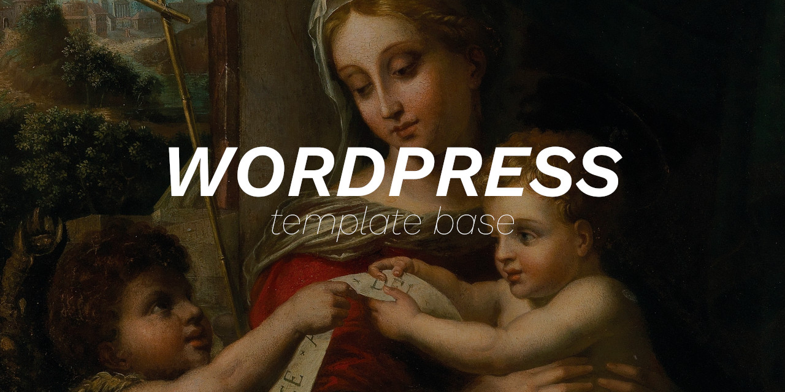

 

    
      
    
    
    
    
    
    

 

Language: <a href="readme-pt.md">PT-BR</a>

This project is a base structure to create Wordpress themes.

 

Description of the files in the <b>theme</b> directory:

- <b>style.css</b>: information about the theme (they will appear in the Dashboard theme manager).
- <b>functions.php</b>: theme settings.
- <b>header.php</b>: title, meta tags, libraries and the like.
- <b>footer.php</b>: libraries loaded at the bottom of the page, and the like.
- <b>index.php</b>: home display control.
- <b>page.php</b>: page display control.
- <b>single.php</b>: post display control.
- <b>comments.php</b>: comment display control.
- <b>404.php</b>: non-existing page error.
- <b>sidebar.php</b>: control of the things that appear in the sidebar.
- <b>searchform.php</b>: search field control.
- <b>screenshot.png</b>: thumbnail of the image that will appear in the themes administration area in the Wordpress Dashboard.

Directories:
- <b>theme/css</b>: theme CSS files. 
- <b>theme/js</b>: theme JS files. 

 

**If my code has helped you, please consider [sponsoring me](https://github.com/sponsors/melchisedech333) :blue_heart:** 

 

:smiley: Author
---

Sponsor: [melchisedech333](https://github.com/sponsors/melchisedech333) 
YouTube: [Melchisedech](https://www.youtube.com/channel/UC4Sh4wxncr5arnydpUfWPKw) 
Twitter: [Melchisedech333](https://twitter.com/Melchisedech333) 
Blog: [melchisedech333.github.io](https://melchisedech333.github.io/) 
LinkedIn: [Melchisedech Rex](https://www.linkedin.com/in/melchisedech-rex-724152235/)

 

:scroll: License
---

[ BSD-3-Clause license](./license)

  

## Remember to give me   a beautiful little star :star_struck:

